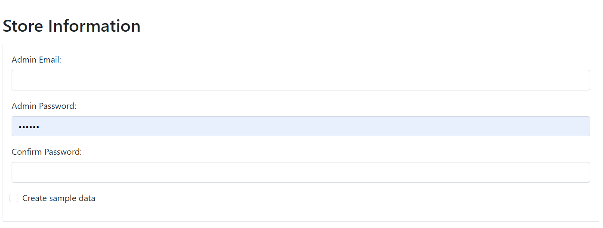
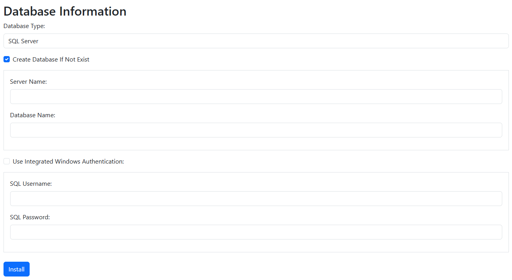

# TCommerce EN | [VI](./README.md)

- An e-commerce project built with ASP.NET Core MVC.

## Overview
- This is a small e-commerce application designed to improve programming skills.

## Requirements

- [.NET 9](https://dotnet.microsoft.com/en-us/download/dotnet/9.0)
- [Visual Studio 2022 (v17.12 or later)](https://visualstudio.microsoft.com/vs/)
- [Microsoft SQL Server 2019 or 2022](https://www.microsoft.com/en-us/sql-server/sql-server-downloads)

## Installation Guide
1. Clone the project from GitHub:

    ```bash
    git clone https://github.com/txqt/TCommerce.git
    ```

2. Open the `TCommerce.sln` solution file using Visual Studio 2022.
3. Run the following command to install NuGet packages:

    ```bash
    dotnet restore
    ```

4. Build the project in Visual Studio.
5. Ensure `TCommerce.Web` is set as the startup project.
6. Run the project.
7. Fill in the required database information when prompted:
    
    
    

## Key Features

- **Product Management**: Add, edit, delete products, manage attributes, add images, and link related products.
- **Attribute Management**: Add, edit, delete product attributes.
- **Category Management**: Add, edit, delete categories and assign products to them.
- **Manufacturer Management**: Add, edit, delete manufacturers and assign products to them.
- **User Management**: Add, edit, delete users, and manage their roles.
- **Role and Permission Management**: Add or remove permissions for one or more roles.
- **Order Management**: Process orders, track statuses, and manage order histories.
- **Online Payment Integration**: Supports VNPAY (sandbox).
